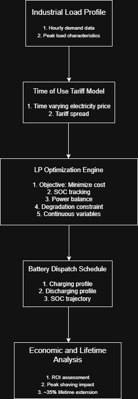

# Second-Life Battery Techno-Economic Optimization  
*(Industry Project – Non-Confidential Summary)*

## Project Context

Developed a techno-economic optimization framework to evaluate deployment of second-life EV batteries in industrial energy systems.

This work was conducted under a Non-Disclosure Agreement (NDA).  
Source code, datasets, and proprietary parameters are not publicly available.

---

## Objective

To determine the optimal dispatch strategy for second-life battery systems under:

- Industrial load demand profiles  
- Time-of-Use (TOU) electricity tariffs  
- Operational degradation constraints  
- Capital investment considerations  

---

## Optimization Framework

- Linear Programming (LP) formulation  
- Continuous decision variables  
- Convex structure with global optimality  
- Implemented in Python using Gurobi  

Degradation was modeled as a throughput constraint to extend effective battery lifetime.

---

## Key Outcomes

- ~35% extension in effective battery lifetime  
- Improved industrial peak shaving performance  
- Identification of tariff spread thresholds for economic viability  
- Sensitivity analysis on degradation and tariff assumptions  

---

## System Architecture

---

## Technical Documentation

For full mathematical formulation, modeling assumptions, and engineering insights, see:

➡ **[TECHNICAL_SUMMARY.md](TECHNICAL_SUMMARY.md)**

---

## Confidentiality Notice

This repository provides a conceptual and methodological overview only.  
Implementation details and datasets remain confidential.
